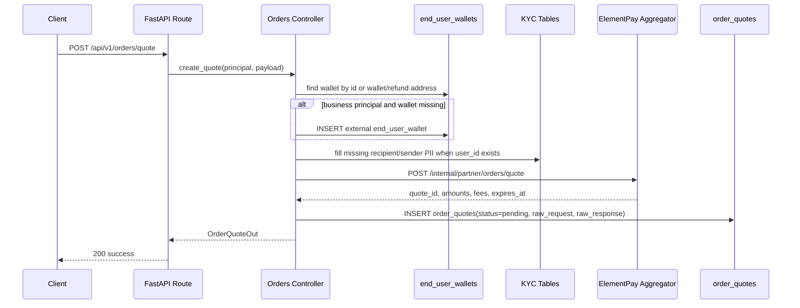
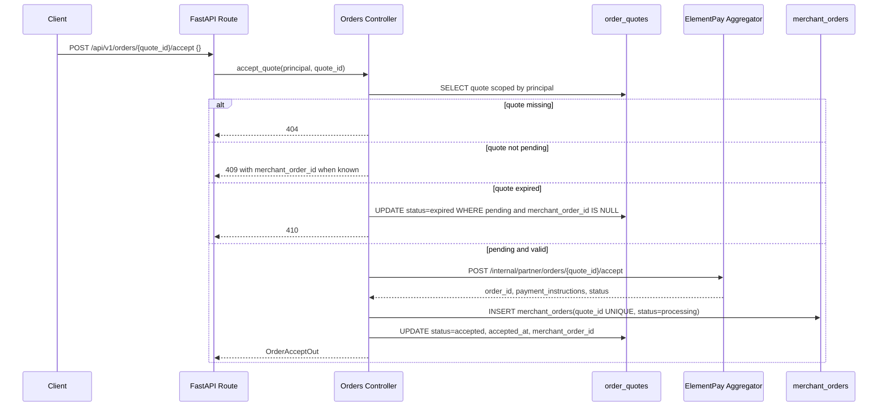
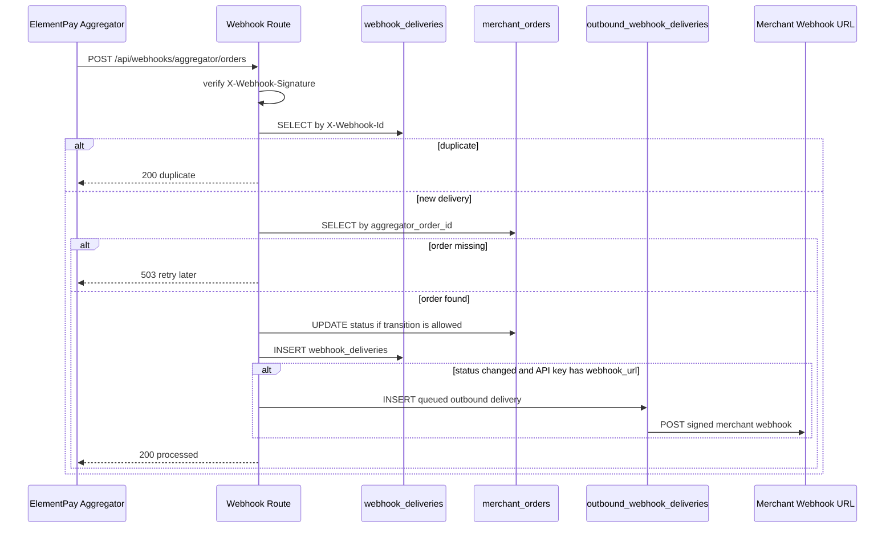

# Order Flow API

This document describes the two-step order creation flow used by Mboka Backend.

1. Create a stateful quote with `POST /api/v1/orders/quote`.
2. Accept the quote with `POST /api/v1/orders/{quote_id}/accept`.
3. Read order state with `GET /api/v1/orders/{merchant_order_id}` or receive merchant webhooks.

The `quote_id` is assigned by the aggregator, persisted by Mboka, and used as the idempotency key for accept.

---

## Authentication

Stateful quote and accept endpoints require either a bearer JWT or an API key.

```http
Authorization: Bearer <access_token>
```

or:

```http
X-API-Key: <raw_api_key>
```

A temporary compatibility path may still accept the old stateless quote payload on `POST /api/v1/orders/quote`, but new integrations should use the objects in this document.

---

## Step 1: Create Quote

```http
POST /api/v1/orders/quote
Content-Type: application/json
Authorization: Bearer <token>
```

### OnRamp Request Object

OnRamp means fiat to crypto. The user pays fiat and receives crypto to `wallet_address`.

```json
{
  "order_type": "OnRamp",
  "token": "0x833589fcd6edb6e08f4c7c32d4f71b54bda02913",
  "currency": "KES",
  "country": "KE",
  "local_amount": "800",
  "wallet_address": "0xde0B295669a9FD93d5F28D9Ec85E40f4cb697BAe",
  "source": {
    "accountType": "momo",
    "accountNumber": "+254711111111",
    "accountName": "Jane Mukami"
  },
  "recipient": {
    "name": "Jane Mukami",
    "phone": "+254711111111",
    "country": "KE",
    "address": "Nairobi",
    "dob": "02/01/1997",
    "email": "jane@example.com",
    "idNumber": "A1234567",
    "idType": "passport"
  },
  "external_order_id": "merchant-order-001",
  "mboka_user_ref": "merchant-user-123"
}
```

### OffRamp Request Object

OffRamp means crypto to fiat. The user sends crypto and receives fiat at `destination`.

```json
{
  "order_type": "OffRamp",
  "token": "0x833589fcd6edb6e08f4c7c32d4f71b54bda02913",
  "currency": "KES",
  "country": "KE",
  "crypto_amount": "20",
  "refund_address": "0x3333333333333333333333333333333333333333",
  "destination": {
    "accountType": "momo",
    "accountNumber": "+254711111111",
    "accountName": "Jane Mukami"
  },
  "sender": {
    "name": "Jane Mukami",
    "phone": "+254711111111",
    "country": "KE",
    "address": "Nairobi",
    "dob": "02/01/1997",
    "email": "jane@example.com",
    "idNumber": "A1234567",
    "idType": "passport"
  },
  "external_order_id": "merchant-order-002",
  "mboka_user_ref": "merchant-user-123"
}
```

### Required Fields

Always required:

| Field | Type | Notes |
|---|---|---|
| `order_type` | `OnRamp` or `OffRamp` | Direction of the order. |
| `token` | string | ERC-20 contract address. |
| `currency` | string | ISO 4217 fiat currency. Uppercased by the API. |
| `country` | string | ISO 3166-1 alpha-2 country. Uppercased by the API. |

OnRamp required:

| Field | Type | Notes |
|---|---|---|
| `local_amount` | decimal string | Fiat amount customer pays. |
| `wallet_address` | string | EVM address receiving crypto. |
| `source` | object | Fiat payment source. |

OffRamp required:

| Field | Type | Notes |
|---|---|---|
| `crypto_amount` | decimal string | Crypto amount customer sends. |
| `refund_address` | string | EVM address for failed-flow refund. |
| `destination` | object | Fiat payout destination. |

### Optional Fields

| Field | Applies To | Behavior |
|---|---|---|
| `recipient` | OnRamp | Optional in schema, but aggregator PII is still required. Mboka fills missing fields from KYC when possible. Missing final fields return `422`. |
| `sender` | OffRamp | Optional in schema, but aggregator PII is still required. Mboka fills missing fields from KYC when possible. Missing final fields return `422`. |
| `end_user_wallet_id` | Both | Links quote and order to an existing wallet. If omitted for business flows, Mboka resolves by wallet address or auto-creates an external wallet. |
| `external_order_id` | Both | Merchant reference stored on `merchant_orders` and echoed in outbound webhooks. This is not an idempotency key. |
| `mboka_user_ref` | Both | Merchant-side user handle stored in `client_metadata.mboka_user_ref`. |

### `source` and `destination` Object

```json
{
  "accountType": "momo",
  "accountNumber": "+254711111111",
  "accountName": "Jane Mukami"
}
```

### `recipient` and `sender` PII Object

All PII fields are optional at the HTTP schema layer because Mboka can fill missing values from KYC. After fallback, all eight fields must be available.

```json
{
  "name": "Jane Mukami",
  "phone": "+254711111111",
  "country": "KE",
  "address": "Nairobi",
  "dob": "02/01/1997",
  "email": "jane@example.com",
  "idNumber": "A1234567",
  "idType": "passport"
}
```

Payload values win over KYC values. Empty strings are treated as missing.

### Quote Response Object

```json
{
  "status": "success",
  "message": "Quote created.",
  "data": {
    "quote_id": "yc_receive_580e04c2",
    "provider": "yellowcard",
    "order_type": "OnRamp",
    "status": "pending",
    "expires_at": "2026-05-19T12:30:00Z",
    "amounts": {
      "rate": "131.69",
      "rate_currency": "KES",
      "user_pays": {"amount": "800", "currency": "KES", "network": null},
      "user_receives": {"amount": "5.94999132", "currency": "USDC", "network": "BASE"},
      "fees": {"service_fee_usd": "0.12", "service_fee_local": "16"}
    },
    "instructions": {
      "available_after_accept": true,
      "note": "Accept this quote to receive final payment instructions."
    }
  }
}
```

---

## Step 2: Accept Quote

```http
POST /api/v1/orders/{quote_id}/accept
Content-Type: application/json
Authorization: Bearer <token>

{}
```

The body is intentionally empty. The path `quote_id` is the accept idempotency key.

### Accept Response Object

```json
{
  "status": "success",
  "message": "Order created.",
  "data": {
    "merchant_order_id": 1234,
    "quote_id": "yc_receive_580e04c2",
    "provider": "yellowcard",
    "status": "processing",
    "order": {
      "order_id": "YC-580e04c2",
      "order_type": "OnRamp",
      "amount_fiat": "800.000000",
      "currency": "KES",
      "amount_crypto": "5.949991320000000000",
      "crypto_currency": "USDC",
      "crypto_network": "BASE",
      "wallet_address": "0xde0B295669a9FD93d5F28D9Ec85E40f4cb697BAe",
      "exchange_rate": "131.69000000",
      "psp_transaction_id": "580e04c2"
    },
    "payment_instructions": {
      "type": "momo",
      "source": {"accountNumber": "+254711111111", "networkName": "Mobile Wallet"},
      "wallet_address": null,
      "amount": null,
      "currency": null,
      "network": null,
      "expires_at": null
    }
  }
}
```

For OffRamp, `payment_instructions.type` is usually `crypto_deposit`:

```json
{
  "type": "crypto_deposit",
  "source": null,
  "wallet_address": "0x4444444444444444444444444444444444444444",
  "amount": "20",
  "currency": "USDC",
  "network": "BASE",
  "expires_at": "2026-05-19T12:30:00Z"
}
```

---

## Step 3: Read Order

```http
GET /api/v1/orders/{merchant_order_id}
Authorization: Bearer <token>
```

Example response:

```json
{
  "status": "success",
  "message": "Order retrieved.",
  "data": {
    "id": 1234,
    "aggregator_order_id": "YC-580e04c2",
    "external_order_id": "merchant-order-001",
    "quote_id": "yc_receive_580e04c2",
    "provider": "yellowcard",
    "order_type": "OnRamp",
    "status": "processing",
    "provider_status": "process",
    "amount_fiat": "800.000000",
    "currency_code": "KES",
    "amount_crypto": "5.949991320000000000",
    "crypto_currency": "USDC",
    "crypto_network": "BASE",
    "exchange_rate": "131.69000000",
    "psp_transaction_id": "580e04c2",
    "checkout_url": null,
    "wallet_address": "0xde0B295669a9FD93d5F28D9Ec85E40f4cb697BAe",
    "client_metadata": {
      "origin_system": "mboka",
      "mboka_business_id": "7",
      "mboka_user_ref": "merchant-user-123",
      "external_order_id": "merchant-order-001"
    },
    "created_at": "2026-05-19T12:00:00Z",
    "updated_at": "2026-05-19T12:01:00Z"
  }
}
```

Other reads:

| Endpoint | Use |
|---|---|
| `GET /api/v1/orders` | Paginated order list for the principal. |
| `GET /api/v1/orders/aggregator/{aggregator_order_id}` | Lookup by aggregator order id. |
| `GET /api/v1/orders/wallet/{end_user_wallet_id}` | List orders linked to one wallet. |
| `GET /api/v1/orders/quote/{quote_id}` | Refresh quote amounts and expiry before accept. |

---

## Errors FE Should Branch On

| Endpoint | HTTP | Message | Action |
|---|---:|---|---|
| `/orders/quote` | `401` | Authentication required | Prompt login or configure API key. |
| `/orders/quote` | `422` | Missing PII fields | Ask for missing PII or complete KYC. |
| `/orders/quote` | `502` | Aggregator returned 5xx | Show retry. Create a fresh quote. |
| `/orders/quote` | `504` | Aggregator timed out | Show retry. Create a fresh quote. |
| `/orders/{quote_id}/accept` | `404` | Quote not found | Re-quote. Quote may belong to another principal. |
| `/orders/{quote_id}/accept` | `409` | Quote already accepted | Navigate to `data.merchant_order_id` when present. |
| `/orders/{quote_id}/accept` | `410` | Quote expired | Re-quote with the same inputs. |
| `/orders/{quote_id}/accept` | `502` / `504` | Upstream failure | Quote remains pending. Retry accept. |

---

## Statuses

Quote statuses: `pending`, `accepted`, `expired`, `rejected`.

Order statuses: `processing`, `completed`, `failed`, `refunded`, `canceled`, `frozen`.

---

## Sequential DB Flow

### Quote Creation



DB writes:

1. Optional `INSERT` into `end_user_wallets` when a business quote references a new wallet or refund address.
2. `INSERT` into `order_quotes` with principal columns, pricing columns, raw aggregator request/response, `status='pending'`, and `expires_at`.
3. No `merchant_orders` row exists yet.

### Quote Acceptance



DB writes on success:

1. `INSERT merchant_orders` with `quote_id`, `aggregator_order_id`, `provider`, `order_type`, `provider_status`, fiat/crypto amount fields, `external_order_id`, and `client_metadata`.
2. `UPDATE order_quotes` to `status='accepted'` with `accepted_at` and `merchant_order_id`.

Concurrency defenses:

- `merchant_orders.quote_id` is unique. If two accept requests race, only one order insert wins.
- The losing request looks up the winning order by `quote_id` and returns `409` with `data.merchant_order_id`.
- The quote update after order creation is unconditional so the sweeper/accept race converges to `accepted` when an order exists.

### Inbound Aggregator Webhook



Important DB behavior:

1. `webhook_deliveries` is written only after the local order update succeeds. This keeps aggregator retry working after a `503 order not found` race.
2. `merchant_orders` status transitions are guarded. Terminal regressions are suppressed.
3. Same-status webhooks may backfill provider or crypto fields, but do not fan out a duplicate merchant webhook.
4. Outbound merchant delivery is queued in `outbound_webhook_deliveries` and retried independently.

### Quote Expiry Sweeper

Every 60 seconds, the background sweeper runs the equivalent of:

```sql
UPDATE order_quotes
   SET status = 'expired'
 WHERE status = 'pending'
   AND expires_at IS NOT NULL
   AND expires_at < now()
   AND merchant_order_id IS NULL;
```

The `merchant_order_id IS NULL` condition prevents the sweeper from expiring a quote that already produced an order.

---

## Tables Touched

| Table | Written During | Purpose |
|---|---|---|
| `end_user_wallets` | Quote creation, optional | Auto-created external wallet for new business wallet/refund address. |
| `order_quotes` | Quote creation, accept, sweeper | Stateful quote, quote status, expiry, raw aggregator audit data, accepted order link. |
| `merchant_orders` | Accept, inbound webhook | Accepted order and status lifecycle. |
| `webhook_deliveries` | Inbound webhook | Deduplicates aggregator webhook deliveries by `X-Webhook-Id`. |
| `outbound_webhook_deliveries` | Inbound webhook fan-out | Queue and retry state for Mboka to merchant webhooks. |

---

## Outbound Merchant Webhook Object

When an order status changes and the originating API key has `webhook_url` and `webhook_secret`, Mboka sends a signed webhook to the merchant.

Headers:

```http
X-Webhook-Id: <delivery_id>
X-Webhook-Event: order.processing | order.settled | order.failed | order.refunded
X-Webhook-Signature: t=<unix_ts>,v1=<base64_hmac_sha256>
```

Payload:

```json
{
  "merchant_order_id": 1234,
  "aggregator_order_id": "YC-580e04c2",
  "external_order_id": "merchant-order-001",
  "quote_id": "yc_receive_580e04c2",
  "provider": "yellowcard",
  "order_type": "OnRamp",
  "status": "completed",
  "provider_status": "settlement_complete",
  "amount_fiat": "800.000000",
  "currency": "KES",
  "amount_crypto": "5.949991320000000000",
  "crypto_currency": "USDC",
  "crypto_network": "BASE",
  "exchange_rate": "131.69000000",
  "wallet_address": "0xde0B295669a9FD93d5F28D9Ec85E40f4cb697BAe",
  "psp_transaction_id": "580e04c2",
  "client_metadata": {
    "origin_system": "mboka",
    "mboka_user_ref": "merchant-user-123"
  },
  "occurred_at": "2026-05-19T12:05:00Z"
}
```

Skip conditions:

- `merchant_orders.api_key_id` is null.
- API key has no `webhook_url` or no `webhook_secret`.
- The normalized order status did not change.
